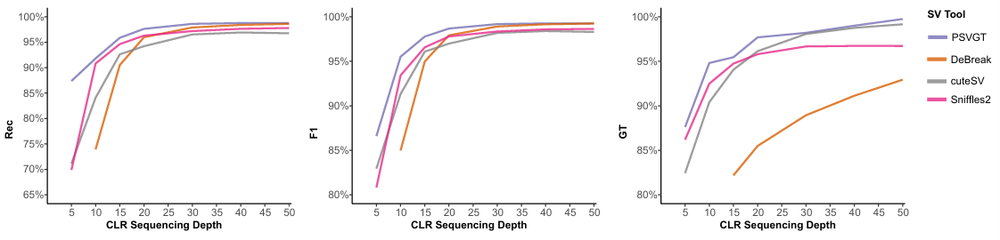
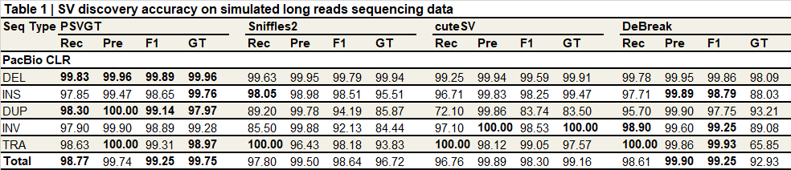

## PSVGT: Population-Scale Structural Variant Calling and Genotyping Computation Framework

**PSVGT** is a versatile toolkit for **structural variant (SV) detection and genotyping at population scale**.  
It supports sequencing reads of both long/short platform, and assemblies. the performance has been tested on:

- Haplotype assemblies  
- Diploid and tetraploid assemblies  
- Allodiploid assemblies  
- Common genome assemblies 
- Long-read data (HiFi, ONT, CLR)  
- Illumina short reads  

PSVGT also provides integrated modules for:

- **CAPS marker development**  
- **InDel primer design**  
- **SV functional annotation**

Short-read samples are assembled into contigs before SV detection, while haplotype assemblies and long-read data can be directly used for SV detection and genotyping.

---

## 💻 Installation

### Requirements

- megahit  
- minimap2  
- samtools  
- Python ≥ 3.11  

### Install

```bash
git clone https://github.com/lgbTime/PSVGT.git
pip install primer3-py pyfiglet pandas tqdm pysam intervaltree
````

---

## 🔨 General Usage

```bash
usage: PSVGT1.0.py [-h] [-o OUTDIR] [-sr SRDIR] [-hifi HIFIDIR] [-ont ONTDIR]
                   [-pb PBDIR] [-cr CRDIR] [-diploid DIPLOID] [-polyploid POLYPLOID]
                   [-r REFGENOME] [--num_hap NUM_HAP] [-msv MSV_MODE]
```

> **Note:** `-r / --refGenome` is required.

### Polyploid SV Detection

Set `--num_hap` according to ploidy:

* Diploid: `--num_hap 2`
* Tetraploid: `--num_hap 4`

### SV Genotyping

PSVGT performs **forced genotyping**, using candidate SVs, alignments, CIGAR strings, breakpoints, and spanning reads to infer genotypes (0/0, 0/1, 1/1).

Recommended long-read parameters:

* Tetraploid long reads: `lr_homo_rate` in range **0.75–0.95**
* Assembly long reads: `lr_homo_rate` in range **0.75–0.95**

---

## ⏩ One-Step PSVGT (Quick Start)

This is the simplest way to run PSVGT on mixed sequencing data.

```bash
python PSVGT1.0/PSVGT1.0.py \
    -hifi test_hifi \
    -ont test_ont \
    -pb test_pb \
    -sr test_sr \
    -cr test_cr \
    -r Db-1_ref/Db-1_genome.fa \
    -b yes \
    -msv yes \
    -o out4PSVGT
```

### Input Folder Requirements

| Folder                         | Content Type                  |
| ------------------------------ | ----------------------------- |
| test_hifi / test_ont / test_pb | gzipped FASTQ or mapped BAM   |
| test_cr                        | Assembly FASTA (.fa / .fasta) |
| test_sr                        | Paired-end gzipped FASTQ      |

### Key Parameters

* `-r` Reference genome
* `-o` Output directory
* `-msv yes` Detect all SV types (not only InDels)
* `-cr` Assembly input
* `-sr` Short-read input

---

## 📊 Benchmark Performance

### Highest sensitivity and genotype accuracy on long-read benchmark



### Performance on simulated long-read benchmark



---

## 🧩 Step-by-Step: Starting from Pre-aligned BAM

### 1. SV Signal Extraction

```bash
python PSVGT1.0/PSV_Signal/0.Signal4bam_PSVGT.py \
    -b 0_tmp_hifi_5.gz.bam \
    -o 5X \
    -m 40 \
    -maq 30 \
    -dtype hifi \
    -fai Db-1_genome.fa.fai \
    -msv yes
```

---

### 2. Signal Clustering and Depth Filtering

```bash
python PSVGT1.0/PSV_Signal/0.KLookCluster_LocalDepthAdaptive.py \
    -f 5X_Db-Chr1.record.txt \
    -s 800 \
    -dtype hifi \
    --b 0_tmp_hifi_5.gz.bam
```

---

### 3. Merge Chromosome-Level Signals

```bash
python PSVGT1.0/PSV_Signal/1.ACCSV_Signal_Cluster.py \
    -preffix 5X \
    -fai Db-1_genome.fa.fai
```

Output:

```
5X_Cluster_Record.txt
```

---

### 4. Merge Population SV Signals

```bash
python PSVGT1.0/PSV_signal/1.PSV_signal_cluster.py \
    -d ./ \
    -s 40
```

Final candidate SV file:

```
PopSV_clustered_Record.txt
```

---

## 🧬 SV Genotyping

```bash
python PSVGT1.0/PSV_Genotyper/2.Pop_lrSVGT_V1.py \
    -i PopSV_clustered_Record.txt \
    -m 30 \
    -s 100 \
    -mapf 0_tmp_hifi_5.gz.bam \
    -n 5X_hifi \
    -o output_dir
```

---

## 🧬 PSVGT on Genome Assemblies

### Haploid Assembly

```bash
python PSVGT1.0/PSVGT1.0.py -cr genome_bam -r ref.fa -msv yes -m 50 -o outfolder
```

### Diploid Assemblies

```bash
cat diploid.info
HG00171_clr_hap1.fasta.bam HG00171_clr_hap2.fasta.bam HG00171_clr

python PSVGT1.0/PSVGT1.0.py -cr genome_bam -r ref.fa -msv yes -m 50 -o outfolder --diploid diploid.info
```

### Polyploid Assemblies

```bash
cat polyploid.info
C_hap1.bam C_hap2.bam C_hap3.bam C_hap4.bam SampleName

python PSVGT1.0.py -cr genome_bam -r ref.fa -msv no -m 50 -o outfolder --polyploid polyploid.info --num_hap 4
```

---

## 🧰 PSVGT Toolkits

### CAPS Marker Development

```bash
samtools mpileup -b bam_lst.txt -q 55 -Q 30 \
 | python PSVGT1.0/CapsPop/mpileup_stdin4popcasp.py > PopCaps_input.txt

python PSVGT1.0/CapsPop/pop_maf0.05_caps.py \
    PSVGT1.0/CapsPop/common_enzyme.list \
    reference.fa \
    PopCaps_input.txt \
    Out_PopCaps_maf0.05.txt \
    300
```

---

### SV Functional Annotation

```bash
python SVInDel_Anno/SV_Features_Annotation.py \
    -g test.gff3 \
    -s PSVGT_all.vcf2.SVInDel \
    -m ID \
    -c Parent \
    -o SVInDels_Lead_Gene_Variant.txt
```

---

### SVInDel Primer Design

```bash
python SVInDel_Primer/vcf2primer.py \
    PSVGT_all.vcf2.SVInDel \
    Db-1_genome.fa \
    > PSVInDel_Primer4Pop.txt
```
---

## ⚠️ Notes

* The reference genome should **not contain thousands of small contigs**.
  Remove very small scaffolds before running PSVGT.

---

## 📚 Preprint

This project is described in the following preprint:

**Guangbao Luo**, Li Xiao, Zhangjun Fei, Xin Wang
*A sensitive and accurate framework for population-scale structural variant discovery and genotyping across sequence types.*
**bioRxiv 2026.01.10.698766v2**
[https://doi.org/10.1101/2026.01.10.698766v2](https://doi.org/10.1101/2026.01.10.698766v2)

---

## 📧 Contact

For questions or support:
**Email:** [13414960404@163.com](mailto: 13414960404@163.com)

